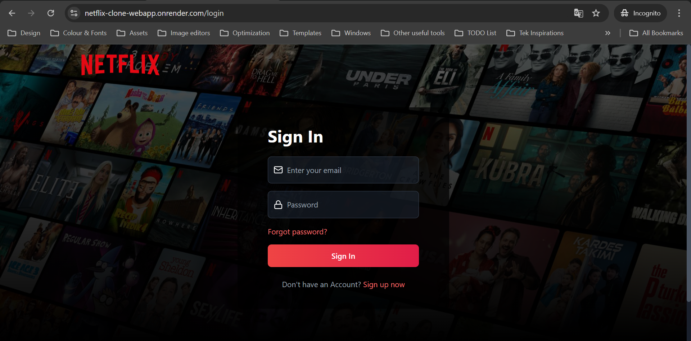
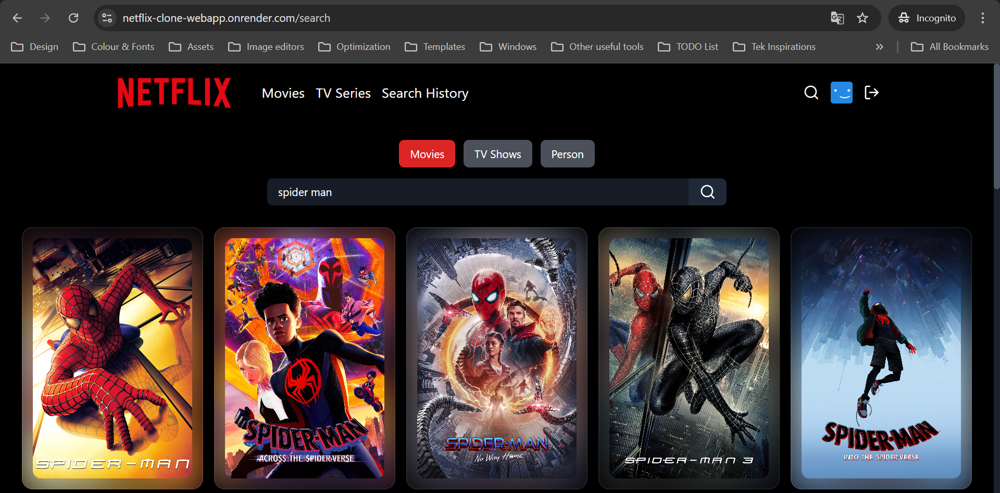
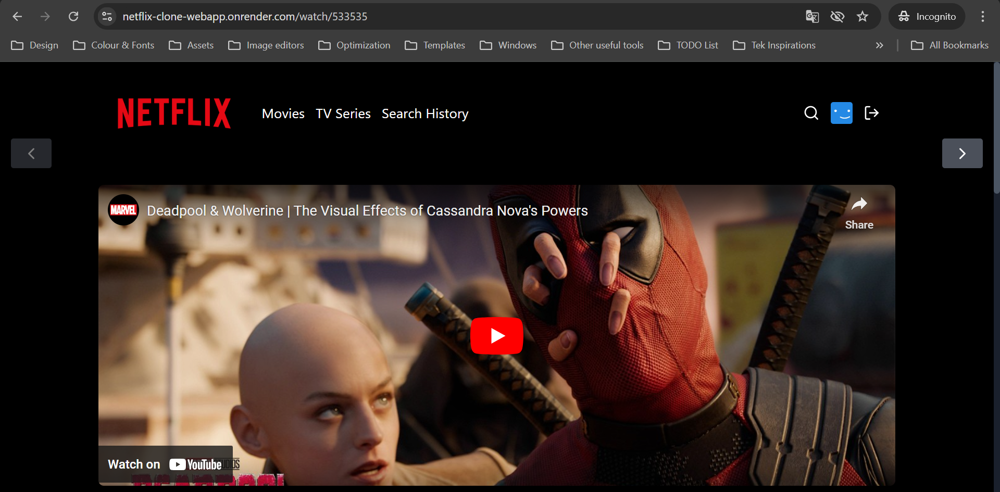

<a name="top"></a>
<h1 align="center">🎬 MERN Netflix Clone — By Nishad Sharma</h1>


<p align="center">
  A full-stack Netflix Clone built using the MERN stack, featuring user authentication, subscription plans, movie/series browsing, search, video playback, and watchlist.
</p>

---

## 📸 Project Preview

<table>
  <tr>
    <td>
      <a href='./preview/login-screen.png'></a>
    </td>
    <td>
      <a href='./preview/search-page.png'></a>
    </td>
    <td>
      <a href='./preview/watch-trailers.png'></a>
    </td>
  </tr>
</table>

---

## 📖 About This Project


This project is a **Netflix Clone** that replicates core streaming platform features with a clean, responsive UI and secure backend.  
It uses the **MERN Stack** with third-party API integration from **TMDB**.

---

## ⚙️ Tech Stack

- <kbd>[React.js](https://react.dev/)</kbd>
- <kbd>[Node.js](https://nodejs.org/en)</kbd>
- <kbd>[Express.js](https://expressjs.com)</kbd>
- <kbd>[MongoDB](https://www.mongodb.com)</kbd>
- <kbd>[Tailwind CSS](https://tailwindcss.com/)</kbd>
- <kbd>[TMDB API](https://developer.themoviedb.org/)</kbd>

---

## 🔧 Features

### Backend  
- 🗄️ MongoDB database with Mongoose models  
- 🔐 JWT authentication & authorization  
- 📧 Email verification and password reset (Mailtrap)  
- 🎬 Fetch movies/TV shows & similar content from TMDB API  
- 🔎 Search for actors and movies  
- 🔒 Route protection & middleware handling  

### Frontend  
- 📋 Signup/Login UI & functionality  
- 📧 Email verification flow  
- 🔄 Forgot/Reset password system  
- 🎥 Watch trailers directly from the app  
- 📱 Fully responsive UI with Tailwind CSS  
- 🔥 Search history tracking  
- 💙 Interactive landing page  

---

## 🖥️ System Requirements

- Node.js **20.12.0+**
- React.js **18.3.1+**
- macOS, Windows, or Linux
- VSCode or preferred editor

---

## 📂 Project Structure

(Root)
├── backend
│ ├── config
│ ├── controllers
│ ├── helpers
│ ├── middlewares
│ ├── models
│ ├── routes
│ ├── services
│ ├── app.js
│ └── package.json
│
├── frontend
│ ├── public
│ ├── src
│ │ ├── components
│ │ ├── hooks
│ │ ├── pages
│ │ ├── store
│ │ ├── utils
│ │ ├── app.jsx
│ │ ├── main.jsx
│ │ └── index.css
│ └── package.json
│
└── package.json


---

## 🚀 Quick Start

### 1️⃣ Clone Repository
```bash
git clone https://github.com/NishadSharma/NetflixClone.git
cd NetflixClone

2️⃣ Install Dependencies
npm install
npm install --prefix backend
npm install --prefix frontend

3️⃣ Setup Environment Variables

Create a .env file in the root directory:

SERVER_PORT=8000
NODE_ENV=development

CLIENT_HOST=localhost
CLIENT_PORT=5173
CLIENT_URL=http://localhost:5173

JWT_SECRET=your_jwt_secret
MONGO_URI=your_mongodb_uri

TMDB_API_KEY=your_tmdb_api_key

MAILTRAP_TOKEN=your_mailtrap_token
MAILTRAP_ENDPOINT=https://sandbox.api.mailtrap.io/api/send/{your_mailbox_id}

4️⃣ Run in Development
npm run dev

📦 Scripts

For Windows

"scripts": {
  "dev": "SET NODE_ENV=development&& concurrently \"cd backend && npm run dev\" \"cd frontend && npm run dev\" ",
  "start": "SET NODE_ENV=production&& node backend/app.js",
  "build": "npm install && npm install --prefix backend && npm install --prefix frontend && npm run build --prefix frontend",
  "format": "prettier --print-width=120 --write ."
}


For macOS/Linux

"scripts": {
  "dev": "NODE_ENV=development&& concurrently \"cd backend && npm run dev\" \"cd frontend && npm run dev\" ",
  "start": "NODE_ENV=production&& node backend/app.js",
  "build": "npm install && npm install --prefix backend && npm install --prefix frontend && npm run build --prefix frontend",
  "format": "prettier --print-width=120 --write ."
}

📬 Contact

👨‍💻 Author: Nishad Sharma
📧 Email: your.email@example.com
🔗 Portfolio: [Your Portfolio Link]
💼 LinkedIn: [Your LinkedIn Profile]
🌐 GitHub: https://github.com/NishadSharma

⬆ Back to top


---

If you want, I can also make you a **highly visual GitHub README** version of this with **animated GIF previews, custom badges, and a dark Netflix-style header banner** so it instantly stands out to recruiters browsing your repo.  
That would make this look **premium and portfolio-ready**.
